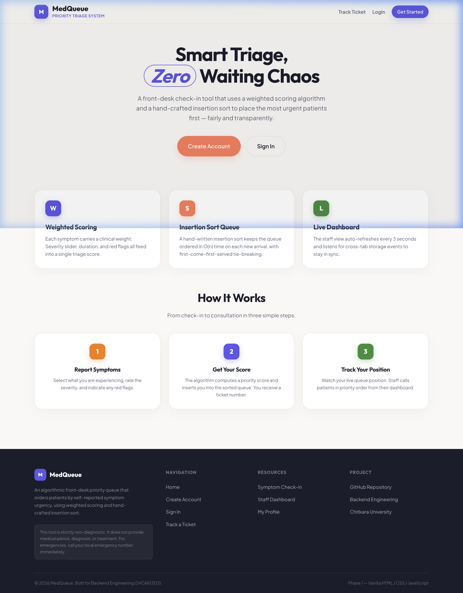
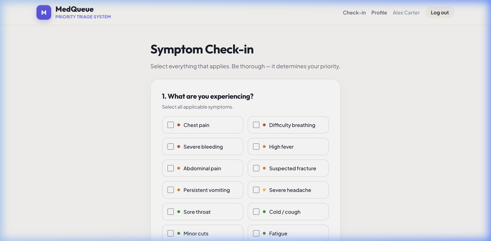
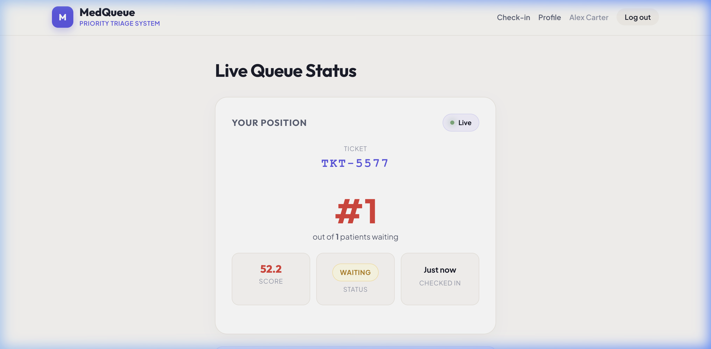
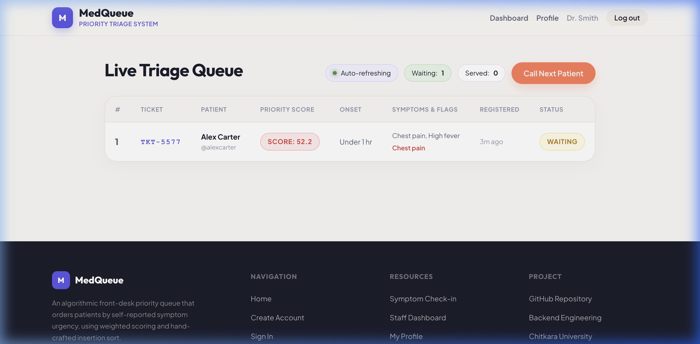
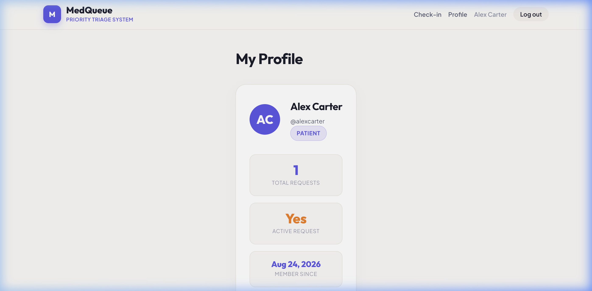

# MedQueue: Priority Triage System

MedQueue is a smart front-desk triage and priority queue system designed for clinics and emergency rooms. Built for the Back End Engineering course (24CAI0303) at Chitkara University.

> **⚠️ IMPORTANT DISCLAIMER:** This tool is strictly **educational and non-diagnostic**. It does not provide medical advice, diagnosis, or treatment.

---

## 📸 Screenshots

### 1. Landing Page

*A professional, responsive landing page introducing the smart triage system.*

### 2. Patient Check-In & Text Analysis

*Patients self-report symptoms, severity, and duration. Includes NLP text-analysis on the additional notes.*

### 3. Live Patient Status

*Patients can view their dynamically updating queue position, algorithmic score breakdown, and estimated wait time.*

### 4. Staff Dashboard & Emergency Override

*Staff view a live, insertion-sorted queue. Includes a "Mark Critical" emergency override button.*

### 5. Patient Profile & Dark Mode

*Patients can view their visit history. The entire application supports a toggleable Dark Mode.*

---

## ⚙️ Technical Details (Phase 1)

This repository houses **Phase 1** of the project, built strictly with **Vanilla HTML, CSS, and JavaScript**.

- **State Management**: Data persistence is simulated using the browser's `localStorage` and `sessionStorage`. Cross-tab synchronization allows the patient's screen to update instantly when a staff member calls them.
- **Core Algorithm (`js/triage.js`)**: Calculates a priority score (0-100) based on weighted variables (symptom severity, sudden onset bonus, vital red flags, and keyword analysis of patient notes).
- **Queue Manager (`js/queue.js`)**: Maintains an ordered array using **Insertion Sort**. Since the queue is always sorted, inserting a single new patient via insertion sort is highly efficient `O(N)`. 
- **Tie-Breaking Rule**: If two patients score exactly the same, the algorithm strictly places the earlier arrival first.

## 🚀 Features
- Role-based Authentication (Patient vs Staff Access Codes)
- Algorithmic Priority Scoring & Text NLP Analysis
- O(n) Insertion Sort Queue Management
- Live Cross-Tab Synchronization
- Duplicate Request Prevention
- Dark Mode / Light Mode Toggle
- Public Ticket Tracking (`lookup.html`)
- Printable Tickets (`window.print()`)
- Staff "Emergency Override" to manually bypass the algorithm

---

## 💻 Installation & Setup

To run this project on any new computer, follow these simple steps:

### Prerequisites
- You need **Python 3** installed to run a local web server (or any similar local server like `http-server` via Node.js).
- A modern web browser (Chrome, Firefox, Safari).

### Steps
1. **Clone the Repository**
   ```bash
   git clone https://github.com/Rakshit9877/bee_project.git
   cd bee_project
   ```

2. **Start the Local Server**
   Run the following command in the project root directory:
   ```bash
   python3 -m http.server 8080
   ```
   *(If you use Node.js, you can alternatively run `npx http-server -p 8080`)*

3. **Access the Application**
   Open your browser and navigate to:
   ```text
   http://localhost:8080
   ```

### Note on State
Because this uses `localStorage`, all users and queue data will persist locally on your specific browser even if you stop the server. To reset the application, clear your browser's site data/local storage.
